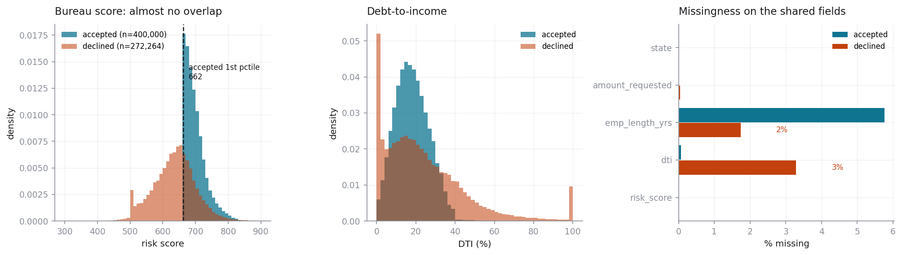
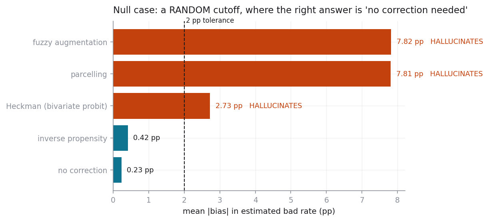
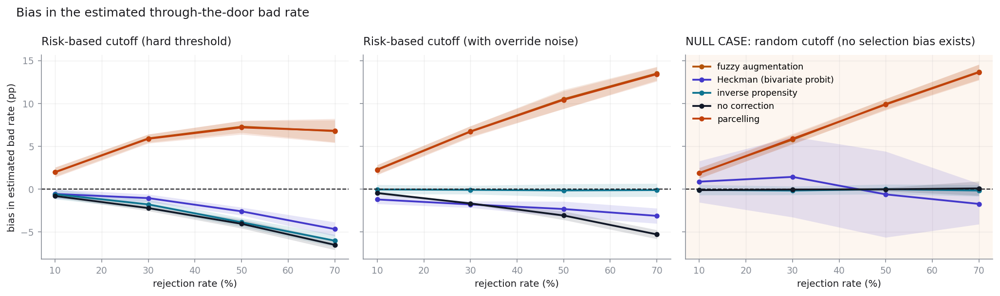

# Selection-bias audit for credit scorecards

**A lending scorecard is only ever validated on the applicants it approved.**
Its reported Gini is therefore measured on a population its own cutoff already
filtered, and its cutoff may be discarding business it would have been paid to
write. This repo quantifies both — and, more usefully, tests whether the
standard corrections for the problem can be trusted at all.

Built on the two LendingClub files: **2,260,668 funded loans** with
repayment outcomes, and **27,648,741 declined applications** with
none. Everything is reproducible from a pinned seed with one command.

---

## Read this first: the thin-overlap ceiling

This is the binding constraint on the entire project, so it goes at the top
rather than in a limitations section at the bottom.

The accepted file carries about 150 columns. The rejected file carries nine.
A model that uses anything outside the intersection cannot be scored on a
declined applicant, so **the entire usable feature set is four numeric fields
and one categorical one**: bureau risk score, debt-to-income, employment
length, amount requested, and state. That is a thin basis for a scorecard and
it caps how well *any* method here can possibly do.

It is worse than thin. It is holed:

| Problem | Scale |
| --- | --- |
| Declines with **no bureau score at all** | **67%** — and concentrated in later vintages (93% missing in 2018) |
| Scored declines reaching the 1st percentile of the approved book | **33.2%** |
| Approved loans with no settled outcome yet (dropped) | 40% |
| Platform approval rate | 7.6% |

Three further mismatches, stated plainly:

- **The two "scores" are not the same instrument.** Approved loans carry a FICO
  range from the bureau pull. Declines carry a field LendingClub calls
  `Risk_Score`. Similar scale, similar behaviour, no guarantee of the same
  model or vintage.
- **Debt-to-income is not measured the same way.** Verified income on the
  approved side; self-reported on the declined side, including values that are
  physically impossible. This pipeline sets those to missing rather than
  clipping them, because a DTI of 50,000% is a bad record, not a high DTI.
- **The dates mean different things.** Declines record the *application* date;
  approvals record the *funding* date, a few weeks later.

Because an accepts-only scorecard never sees a missing bureau score, it has no
bin for one and would score those applicants as merely *average* — exactly
backwards. The audit therefore restricts the decline population to scored
applications (272,264 of 829,863 sampled). **The
excluded two-thirds are a real, unquantified limitation.**

---

## Headline numbers

| | |
| --- | --- |
| Reported Gini (held-out, approved loans only) | **0.2803** |
| KS / AUC | 0.2018 / 0.6401 |
| Observed bad rate on approved loans | 19.9% |
| Estimated through-the-door bad rate | **20.7% to 43.6%** depending on method |
| Heckman selection correlation ρ | **0.018** (se 0.018, LR p = 0.319) |
| Least-biased method in simulation | **ipw** (1.77 pp mean abs. error) |
| Where it stops working | heckman and ipw held within 2 pp up to a 30% rejection rate, beyond which every method exceeds it. Applying no correction at all held equally far (30%), so on this evidence none of the four earned its place. |
| Methods that fail the null case | **| Method | Error under a random cutoff | Excess over doing nothing | one-sided p |
| --- | --- | --- | --- |
| **fuzzy** | 7.82 pp | +7.59 pp | 1e-07 |
| **parcelling** | 7.81 pp | +7.58 pp | 1e-07 |
| **heckman** | 2.73 pp | +2.49 pp | 0.0002 |
| none (biased baseline) | 0.23 pp | +0.00 pp | passes |
| ipw | 0.42 pp | +0.19 pp | passes |** |
| Residual ZIP dispersion ratio | 5.2 against 1.0 under the null |



*The two populations barely overlap, and a third of the shared fields are
missing on the declined side. Everything below is bounded by this picture.*

### The three findings that matter

**1. Measured selection bias in this portfolio is small.** The bivariate-probit
selection correlation ρ is **0.018** (se 0.018, LR p = 0.319) with no
exclusion restriction, and **0.042** (LR p = 0.022) when application
year is excluded from the outcome equation. Both are economically negligible - a correlation of this size shifts the corrected bad rate by a fraction of a percentage point.

Three things are worth saying plainly about that pair of numbers. First, the
exclusion restriction is *contestable*: application vintage plausibly affects
default directly through the macro cycle, so excluding it from the outcome
equation is a misspecification that can manufacture apparent selection rather
than reveal it.

Second — and this is the sharpest caveat the simulation produces — **a
significant ρ is not proof of selection bias.** In Part 3 the true ρ is zero by
construction, yet under a soft risk-based cutoff the estimator confidently
reports ρ ≈ 0.25 at p = 0.005. The cause is functional form: both equations
approximate a smooth score with WOE steps, so both residuals carry correlated
approximation error and the estimator reads that as ρ. Misspecification alone
can manufacture a significant selection parameter.

Third, **statistical significance is not economic significance at this sample
size.** With 672,264 applicants,
a correlation of 0.042 is distinguishable from zero and still far too small
to matter. On either specification the honest reading is the same: on the
fields these two populations share, approval carried little information about
default beyond what the scorecard already uses. Manufacturing a larger
correction would have been the actual failure, so this is reported as the
result it is.

**2. Three of the four corrections invent bias that isn't there.** Part 3
replaces the risk-based cutoff with a *random* one, where no selection bias
exists and the correct correction is provably zero. Measured against simply
doing nothing on the same scenarios:

| Method | Error under a random cutoff | Excess over doing nothing | one-sided p |
| --- | --- | --- | --- |
| **fuzzy** | 7.82 pp | +7.59 pp | 1e-07 |
| **parcelling** | 7.81 pp | +7.58 pp | 1e-07 |
| **heckman** | 2.73 pp | +2.49 pp | 0.0002 |
| none (biased baseline) | 0.23 pp | +0.00 pp | passes |
| ipw | 0.42 pp | +0.19 pp | passes |

Magnitudes matter more than the pass/fail flag. Parcelling and fuzzy
augmentation are off by around 7.6 pp because both assume declines default at a
fixed multiple of the approved rate, so they fire whether or not selection was
informative. Heckman's 2.5 pp has a different cause: under a random cutoff the
selection equation has no explanatory power, ρ is unidentified, and while the
**likelihood-ratio test correctly stays insignificant at every rejection rate
swept**, the ρ *point estimate* still wanders enough to move the extrapolated
bad rate. The practical lesson is to act on the test, not on the point estimate.

To be fair to parcelling and fuzzy, the repo re-runs both across a range of
that multiple (`outputs/tables/15_scale_factor_sensitivity.csv`).
At their best multiple they reach 1.8 pp on a risk-based cutoff and 0.2 pp on the null - competitive with the other two. The machinery is not the problem; the conventional multiple is. But the multiple that works differs by regime — 1.0 under the
null, nearer 1.0–1.5 under a risk cutoff — and nothing in the data tells you
which regime you are in. **The null-case failure is structural, not a tuning
problem.**



*The null case. Selection is random, so the correct correction is exactly
zero. Bars that are not near zero are methods reporting a bias that does not
exist.*

**3. The cutoff does not appear to be discarding profitable business.** The
swap-in set — applicants the corrected model would approve and the lender
declined — has an inferred bad rate of 12.5% to 19.2%. That has to be judged
against the break-even those particular applicants face, **7.9% to 8.4%**,
not against the pooled 14.7%: the swap-in set lands in the safest score
bands, where LendingClub priced loans near 9% APR, and over a ~40-month life at
a 3% cost of funds there is very little margin left to absorb any defaults at
all.

All four methods agree on the sign: **approving the swap-in set would have destroyed value, not created it, at every method's estimate of its bad rate. The cutoff is not leaving money on the table here.** The sign is also
stable across the funding-cost sensitivity grid — only the magnitude moves,
from -$577m to -$83m. This contradicts the premise the
tool was built to test, which is why it is stated here rather than buried.

---

## What this does not prove

- **It does not tell you the true bad rate of your declined population.**
  Nothing can, from this data. Those outcomes do not exist. Every Part 2 figure
  is a model-based extrapolation whose error Part 3 measures but cannot remove.
- **It does not validate reject inference on the real portfolio.** The
  simulation validates the methods on a *manufactured* problem where the cutoff
  is known and the features are complete. Real selection used a full credit
  bureau file this analysis cannot see. Harness performance is an upper bound
  on reality.
- **A small ρ is not proof that selection bias is absent.** It is evidence that
  selection bias is small *on the four fields both populations share*. Bias
  operating through variables absent from both files is invisible here, and
  omitted-variable bias cuts against over-reading a small ρ as much as a large
  one.
- **The swap set is not a list of people to approve.** It is large mostly
  because a four-field model ranks differently from a full bureau file, not
  because good business is sitting in the decline bin. The applicants who flip average a $7,149 loan request at 10% DTI with 1.5 years of employment, against $14,410, 18% and 6.0 years on today's book. That
  is a different population, not a set of near-misses, and the correlation
  between model rank and the actual decision is reported alongside it for the
  same reason (`outputs/tables/14_swap_in_profile.csv`).
- **The profit figure is assumption-sensitive in magnitude.** Yields, losses
  and LGD are measured from realised cash flows; cost of funds, servicing and
  loan life are assumptions. Across a defensible funding-cost range the
  estimate moves from -$577m to -$83m — a sevenfold
  spread — though the sign happens to be stable here. The repo publishes the
  whole grid rather than one cell, and the sign's stability is a property of
  this portfolio, not a guarantee.
- **It says nothing about race or any protected attribute.** The geographic
  analysis joins to no census data and infers no demographics from ZIP. A
  3-digit ZIP covers hundreds of thousands of people. The only available claim
  is *unexplained geographic variation in the decline rate* — a pointer for a
  fair-lending review to follow, not a finding of discrimination.
- **It does not transport to your portfolio unexamined.** LendingClub approved
  about 7.6% of applications. A lender approving 60% has a far
  milder selection problem and should expect different answers.

---

## Run it

```bash
make install     # pinned dependencies
make data        # fetch both LendingClub files (CC0, ~650 MB)
make run         # full pipeline -> outputs/headline_numbers.json
make docs        # methodology PDF + 10-slide deck + this README
make test        # test suite
```

Or in one line, from a clean checkout:

```bash
make install && make data && make run && make docs
```

Seed `20260901`, every dependency pinned, every sample drawn from a seeded
generator. `outputs/headline_numbers.json` is the single source of truth — the
PDF, the deck and the numbers in this README are all rendered from it, so none
of them can drift from the pipeline that produced them.

Runtime is roughly 7 minutes on a laptop, dominated by the Part 3 sweep.

---

## What it does

### Part 1 — the biased baseline
A conventional application scorecard on the shared fields: weight-of-evidence
binning, logistic regression, scaled to points (20 points to double the
odds). Deliberately conventional — the question is about the *sample a model is
fitted on*, not the model class, and holding the model fixed keeps the four
corrections comparable.

### Part 2 — reject inference, four ways
Pluggable methods behind one interface. Each must produce a scoring function
that applies to any applicant, and an estimate of the through-the-door bad rate.

| Method | Assumes | Breaks when |
| --- | --- | --- |
| **Parcelling** | declines default at a fixed multiple of the approved rate in the same score band | the multiple is an assumption nothing identifies; it fires regardless of whether selection was informative |
| **Fuzzy augmentation** | the same multiple, as fractional weights rather than drawn labels | identical assumption, sampling noise removed — stable, and stably wrong |
| **Inverse propensity** | approval is uninformative about default given the shared fields | a declined applicant must plausibly have been approvable; here that positivity condition fails badly (approval AUC 0.962) |
| **Heckman** | approval and default are jointly normal with correlation ρ, by full ML | with no exclusion restriction, identification rests on normality alone |

The Heckman implementation is a **bivariate probit with sample selection** (Van
de Ven & Van Praag 1981) estimated by full maximum likelihood with analytic
gradients — the textbook two-step assumes a continuous outcome, and default is
binary. The bivariate normal CDF is computed by Gauss–Legendre quadrature and
is accurate to ~1e-16 (verified against the closed form at the origin;
`scipy`'s own `mvn.cdf` is the less accurate of the two). ρ is reported with a
standard error, a 95% interval and a likelihood-ratio test, **with and without
an exclusion restriction**, so a reader can see how much of the answer is data
and how much is functional form.

### Part 3 — the simulation harness *(the centrepiece)*
Reject inference is normally unfalsifiable: you cannot check an inferred bad
rate against outcomes that do not exist. So the harness manufactures them.

1. Take **only approved loans**, where every outcome is known.
2. Impose an artificial cutoff; discard the outcomes below it and pretend those
   applicants were declined.
3. Run all four methods on that synthetic decline population.
4. Compare each against the truth deliberately hidden from it.

Swept across rejection rates of 10%, 30%, 50%, 70%, 5 replicates each, under
three cutoff shapes: a hard risk threshold, the same with judgemental override
noise, and — critically — **a random cutoff, the null case**, where the correct
answer is known in advance to be "do nothing".



Reported per method: bias in estimated bad rate, bias in the Gini it *claims*
versus the Gini it *actually achieves* on hidden labels, whether the correction
genuinely improved ranking, and across-replicate stability.

The output is a ranking with a breaking point attached, not a preference:

> **heckman and ipw held within 2 pp up to a 30% rejection rate, beyond which every method exceeds it. Applying no correction at all held equally far (30%), so on this evidence none of the four earned its place.**

### Part 4 — what the bias costs
Volume-neutral swap-set analysis (the corrected model approves exactly as many
applicants as the lender does today, so this measures ranking quality, not
appetite), converted to money using LendingClub's realised cash flows for
yields, losses and LGD, with cost of funds and servicing as stated assumptions
and a full sensitivity grid. Plus residual decline-rate variation by 3-digit
ZIP after controlling for modelled risk, as a fair-lending pointer.

---

## Layout

```
run_all.py                  one command; writes outputs/headline_numbers.json
make_report.py              renders the PDF, the deck and this README from it
src/sba/
  config.py                 every knob that moves a number
  data.py                   load + harmonise onto the shared schema
  woe.py                    weight-of-evidence binning (weight-aware throughout)
  scorecard.py              WOE + logistic, scaled to points
  metrics.py                weighted Gini / KS / AUC / effective sample size
  inference/
    base.py                 the pluggable-method contract
    parcelling.py  fuzzy.py  ipw.py  heckman.py
  simulate.py               Part 3 harness, sweep, ranking, null-case test
  economics.py              yields from cash flows, swap set, profit, sensitivity
  geo.py                    residual ZIP dispersion
tests/test_sba.py           estimator correctness on synthetic ground truth
docs/methodology.pdf        assumptions, limitations, "what this cannot tell you"
slides/                     10-slide briefing for a credit risk head
outputs/tables/*.csv        every table behind every figure
```

The tests are not smoke tests. They check the bivariate normal CDF against its
closed form and against high-precision quadrature, the analytic score against
finite differences, ρ recovery on simulated data with known truth, and — the
one that matters most — that the selection test **does not** report bias when
there is none, asserted as a rejection rate across seeds rather than a single
lucky draw.

---

## Data

"All Lending Club loan data" by Nathan George (`wordsforthewise`), CC0 public
domain. `make data` fetches both files from Kaggle's public endpoint into
`data/`, which is gitignored — **no data is committed here**.

## Licence

MIT. See `LICENSE`.
